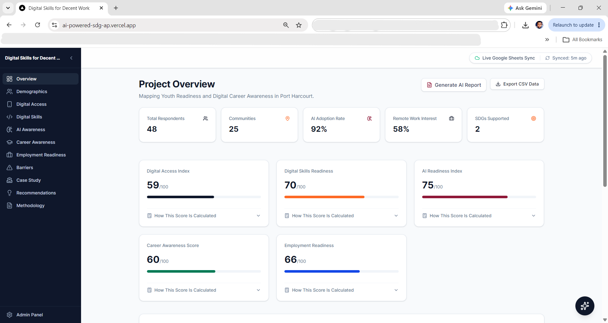
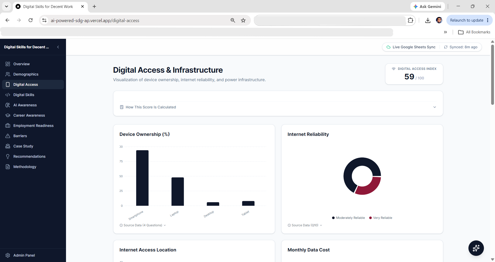
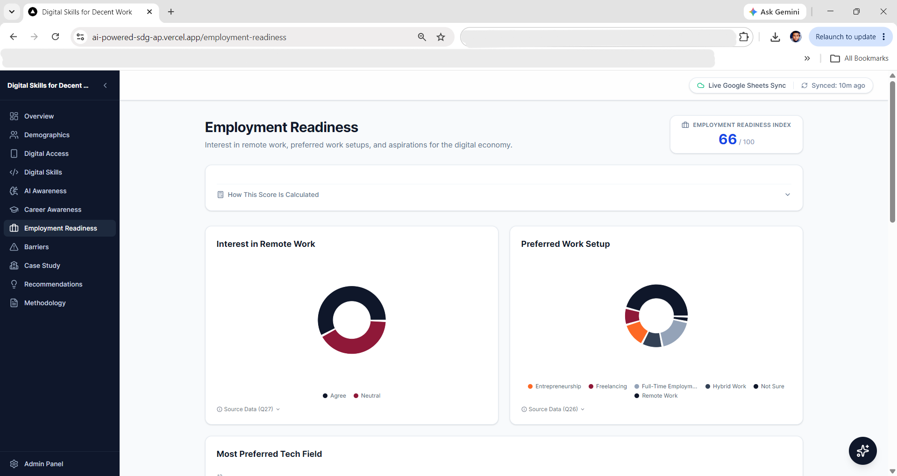

# AI-Powered SDG Analytics Platform

> **Digital Skills for Decent Work: Mapping Youth Readiness and Digital Career Awareness in Port Harcourt**

[](https://ai-powered-sdg-ap.vercel.app/)
[](LICENSE)
[](https://nextjs.org/)
[](https://github.com/supsaveTech/AI-Powered-SDG-AP)

---

## Overview

This platform is an open-source, AI-powered analytics dashboard built for the **SDG Advocate Programme (Cohort 8)** to visualize and analyze data from a primary research survey conducted among youth in Port Harcourt, Rivers State, Nigeria.

The research investigates youth digital readiness, AI awareness, and career awareness as a contribution toward two United Nations Sustainable Development Goals:

- **SDG 8 — Decent Work and Economic Growth**: Promoting youth employment and digital skills development as a pathway to economic participation.
- **SDG 9 — Industry, Innovation and Infrastructure**: Assessing technology access, digital infrastructure challenges, and innovation capacity among youth.

The platform transforms raw survey responses into evidence-based visual analytics, AI-generated policy insights, and SDG impact reports — designed to support advocacy, programme design, and evidence-based decision making.

---

## 🌐 Live Platform

**[https://ai-powered-sdg-ap.vercel.app/](https://ai-powered-sdg-ap.vercel.app/)**

---

## Features

### Survey-Driven Analytics
- **Google Forms → Google Sheets Integration**: Real-time synchronization of survey responses from Google Forms via the Google Sheets API.
- **CSV Upload Fallback**: Administrators can upload exported survey CSVs directly through the Admin Panel if API access is unavailable.
- **Published CSV URL Support**: Environment-configurable published CSV endpoint for serverless environments.
- **Dynamic Analytics**: All charts, KPI cards, and indices update automatically when new data is synced.

### Dashboard Modules

| Module | Description |
|--------|-------------|
| **Overview** | High-level KPI summary, Digital Access Index, AI Readiness Index, and Employment Readiness |
| **Demographics** | Age, gender, education, and location distribution across survey respondents |
| **Digital Access & Infrastructure** | Device ownership, internet reliability, electricity access, and power source analysis |
| **Digital Skills** | Proficiency self-assessment across 8 digital skill categories |
| **AI Awareness** | AI tool adoption rates, frequency of use, and awareness metrics |
| **Career Awareness** | Knowledge of tech career pathways and interest scores |
| **Employment Readiness** | Remote work interest, desired skills alignment, and readiness index |
| **Barriers** | Severity ranking of obstacles to digital skills acquisition |
| **Case Study** | Field observation report from Lift Up Child Education Centre, Elelenwo |
| **Recommendations** | Evidence-based policy recommendations mapped to SDG 8 & 9 targets |
| **Methodology** | Composite index methodology with full survey question traceability |

### AI Features
- **AI Insights Engine**: Generates page-specific structured insights (key findings, trend analysis, recommendations, SDG mapping) from aggregated survey data.
- **AI Data Analyst Assistant**: An in-dashboard chatbot backed by a RAG (Retrieval-Augmented Generation) architecture that answers questions grounded in real survey statistics.
- **Dynamic Report Generation**: On-demand executive summaries with full survey question traceability, downloadable as PDF via browser print.
- **SDG Impact Mapping**: All AI responses reference specific SDG 8 and SDG 9 targets based on the survey findings.
- **OpenAI & Gemini Support**: Configurable to use GPT-4o-mini or Gemini 1.5 Flash; falls back to a sophisticated heuristic engine with no API key required.

### Community Intelligence
- **Community Name Normalization**: Fuzzy-matching engine that deduplicates and standardises community name variants from free-text survey entries.
- **Admin Override Management**: Administrators can define custom canonical name mappings through the Admin Panel.
- **Community Reach Analytics**: Counts unique communities reached by the survey project.

### Transparency & Traceability
- **Survey Question Traceability**: Every chart, KPI, and insight is tagged with the specific survey question(s) that generated it (e.g., `[Source: Q18]`).
- **Index Methodology Panels**: Expandable panels on each dashboard page explain how composite indices are calculated.
- **Data Source Status Indicator**: Live header badge shows whether the platform is reading from Google Sheets API, an uploaded CSV, or demonstration data.
- **Demo Mode Banner**: A clear notification banner appears when the platform is displaying demonstration data, preventing misinterpretation.

---

## Technology Stack

| Technology | Purpose |
|------------|---------|
| **Next.js 15** | React framework with App Router, server components, and API routes |
| **TypeScript** | Type-safe development across the full stack |
| **Tailwind CSS** | Utility-first CSS framework |
| **shadcn/ui** | Accessible UI component primitives |
| **Recharts** | Responsive charting library for all analytics visualizations |
| **Framer Motion** | Smooth animations and micro-interactions |
| **Lucide React** | Consistent icon system |
| **Google Sheets API** | Primary live data source via REST API |
| **CSV Processing Pipeline** | Server-side CSV parsing and data normalization |
| **OpenAI API** | Optional LLM integration (GPT-4o-mini) |
| **Gemini API** | Optional LLM integration (Gemini 1.5 Flash) |

---

## Data Flow

```
Google Forms (Survey Collection)
        ↓
Google Sheets (Response Storage)
        ↓
Google Sheets API  ←──── or ────→  Published CSV URL
        ↓                                  ↓
   DataService Layer (src/services/dataService.ts)
        ↓
Community Normalization + Data Aggregation
        ↓
Analytics Dashboard (Charts, KPIs, Indices)
        ↓
AI Insight Engine + RAG Chatbot

─── Admin Upload Fallback ───────────────────────
Admin Panel → CSV Upload → DataService → Dashboard
```

---

## Screenshots

### Dashboard Overview

> *Replace with actual screenshot*

### Demographics

> *Replace with actual screenshot*

### Digital Access & Infrastructure

> *Replace with actual screenshot*

### AI Awareness

> *Replace with actual screenshot*

### Career Awareness

> *Replace with actual screenshot*

### Employment Readiness

> *Replace with actual screenshot*

### Barriers Analysis

> *Replace with actual screenshot*

### AI Assistant

> *Replace with actual screenshot*

### Executive Report Generator

> *Replace with actual screenshot*

---

## Environment Variables

Create a `.env.local` file in the project root. All variables are optional — the platform falls back through the data source priority chain gracefully.

```env
# ── Google Sheets (Primary Data Source) ─────────────────────────────────────
# Enables live synchronization from your Google Sheets spreadsheet via API.
GOOGLE_SHEETS_API_KEY=your_google_sheets_api_key_here
GOOGLE_SHEETS_SPREADSHEET_ID=your_spreadsheet_id_here

# ── Published CSV URL (Secondary Data Source) ────────────────────────────────
# Fallback: the published CSV export URL from your Google Sheet.
# File → Share → Publish to web → CSV format
GOOGLE_SHEETS_CSV_URL=https://docs.google.com/spreadsheets/d/.../pub?output=csv

# ── AI Provider (Optional) ──────────────────────────────────────────────────
# Set ONE of the following to enable a real LLM for the chatbot and insights.
# If neither is set, the built-in heuristic engine is used automatically.
OPENAI_API_KEY=your_openai_api_key_here
GEMINI_API_KEY=your_gemini_api_key_here
```

### Data Source Priority

The platform resolves data in this order:
1. **Google Sheets API** (if `GOOGLE_SHEETS_API_KEY` + `GOOGLE_SHEETS_SPREADSHEET_ID` are set)
2. **Published CSV URL** (if `GOOGLE_SHEETS_CSV_URL` is set)
3. **Admin-uploaded CSV** (uploaded via the Admin Panel)
4. **Demonstration data** (built-in mock dataset — clearly labelled in the UI)

---

## Running Locally

### Prerequisites

- Node.js 18+
- npm or yarn

### Setup

```bash
# 1. Clone the repository
git clone https://github.com/supsaveTech/AI-Powered-SDG-AP.git
cd AI-Powered-SDG-AP

# 2. Install dependencies
npm install

# 3. Configure environment variables
cp .env.local.example .env.local
# Edit .env.local with your API keys (all optional)

# 4. Start the development server
npm run dev
```

The platform will be available at [http://localhost:3000](http://localhost:3000).

---

## Deployment

### Vercel (Recommended)

1. Fork or clone the repository to your GitHub account.
2. Connect the repository to [Vercel](https://vercel.com/).
3. Add your environment variables in the Vercel project settings.
4. Deploy. Vercel will automatically redeploy on every push to `main`.

### Other Platforms

The platform is a standard Next.js application and can be deployed to any platform that supports Node.js:

```bash
npm run build
npm start
```

---

## Admin Panel

The Admin Panel (`/admin`) provides:

- **Data Source Status**: Current data source (Google Sheets, CSV, or demonstration data).
- **Manual Data Refresh**: Force-refresh from the configured Google Sheets endpoint.
- **CSV Upload**: Upload a survey CSV export to use as the data source.
- **Survey Monitoring**: Visualize response growth over time, including first and latest response dates.
- **Community Name Management**: Define custom canonical name mappings for community deduplication.

---

## Research Impact

This platform supports evidence-based advocacy across six impact areas:

| Impact Area | SDG Alignment |
|-------------|--------------|
| **Youth Digital Readiness Assessment** | SDG 8.6 |
| **Digital Skills Gap Identification** | SDG 8.6, SDG 9.5 |
| **AI Awareness & Adoption Tracking** | SDG 9.5 |
| **Employment Readiness Measurement** | SDG 8.3, SDG 8.5 |
| **Infrastructure & Access Analysis** | SDG 9.1, SDG 9.c |
| **Evidence-Based Policy Advocacy** | SDG 8.b, SDG 17 |

---

## Contributing

Contributions are welcome! This platform is open-source to enable other SDG advocates, researchers, and educators to adapt it for their own survey-based research.

### How to Contribute

```bash
# 1. Fork the repository
# 2. Create a feature branch
git checkout -b feature/your-feature-name

# 3. Make your changes and commit
git commit -m "feat: describe your change"

# 4. Push to your fork
git push origin feature/your-feature-name

# 5. Open a Pull Request on GitHub
```

### Areas for Contribution

- Additional chart types and visualization options
- Multi-language (i18n) support
- Additional AI provider integrations
- Export formats (Excel, JSON)
- Additional dashboard modules
- Unit and integration test coverage

---

## License

This project is licensed under the **MIT License**. See [LICENSE](LICENSE) for details.

---

## Acknowledgements

Developed as part of the **SDG Advocate Programme (Cohort 8)** in partnership with youth organizations and educational institutions in Port Harcourt, Rivers State, Nigeria.

Survey conducted at Lift Up Child Education Centre, Elelenwo, and across multiple communities in Port Harcourt.

---

*Built with ❤️ for youth empowerment and digital inclusion in Nigeria.*
